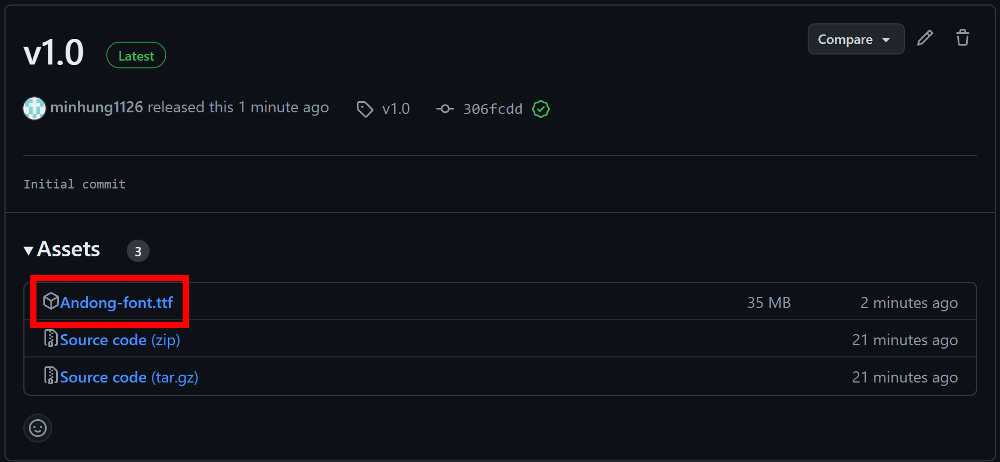
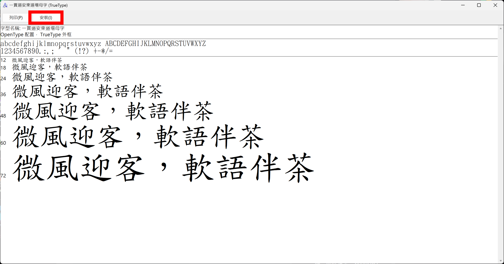

# 一貫道安東道場母字修正字型

## 安裝

### 下載字型檔

[下載連結 Download Link](https://github.com/minhung1126/andong_fonts/releases/latest/download/Andong-font.ttf)\
按**右鍵**、**另存新檔**，並選擇一個好記的位置。

### 安裝字型檔

1. 找到下載的檔案，並按**右鍵**、**開啟檔案**、**Windows字型檢視器**。
2. 按下左上角的**安裝**。

## 使用

打出母親的「母」後，將字體換成「一貫道安東道場母字」即可。

## 授權

本字型修改自**CNS11643中文標準交換碼全字庫**，遵守**政府資料開放授權條款-第1版**以及**開放字型授權條款 OFL-1.1**。
