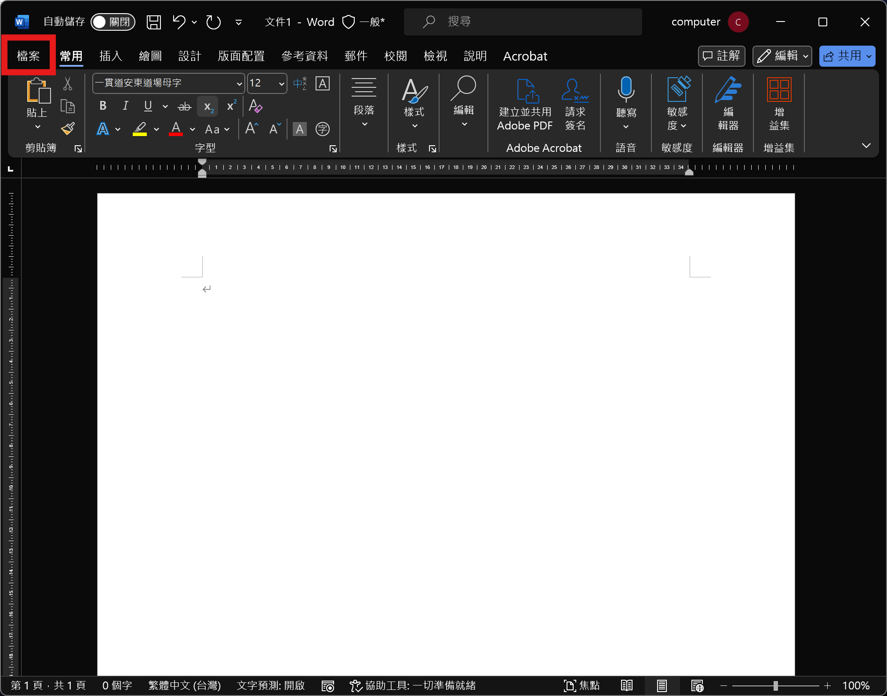
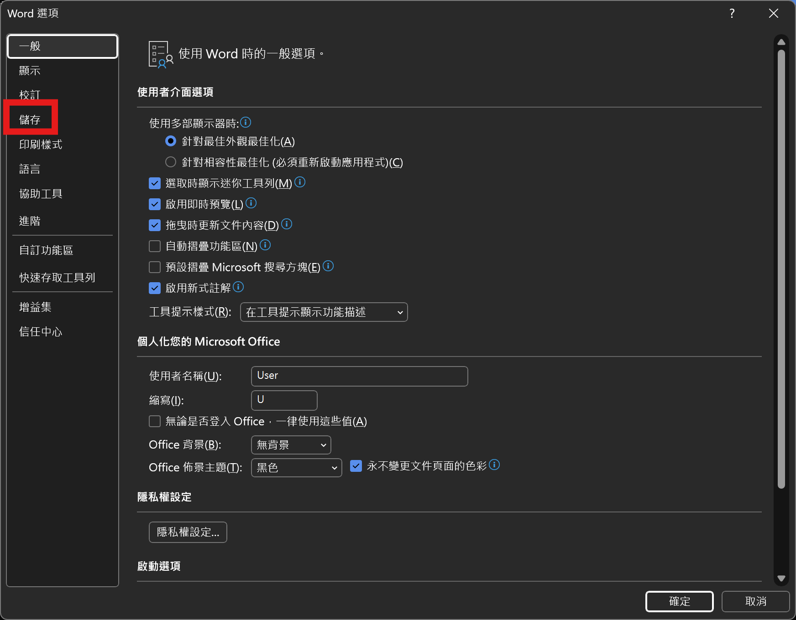
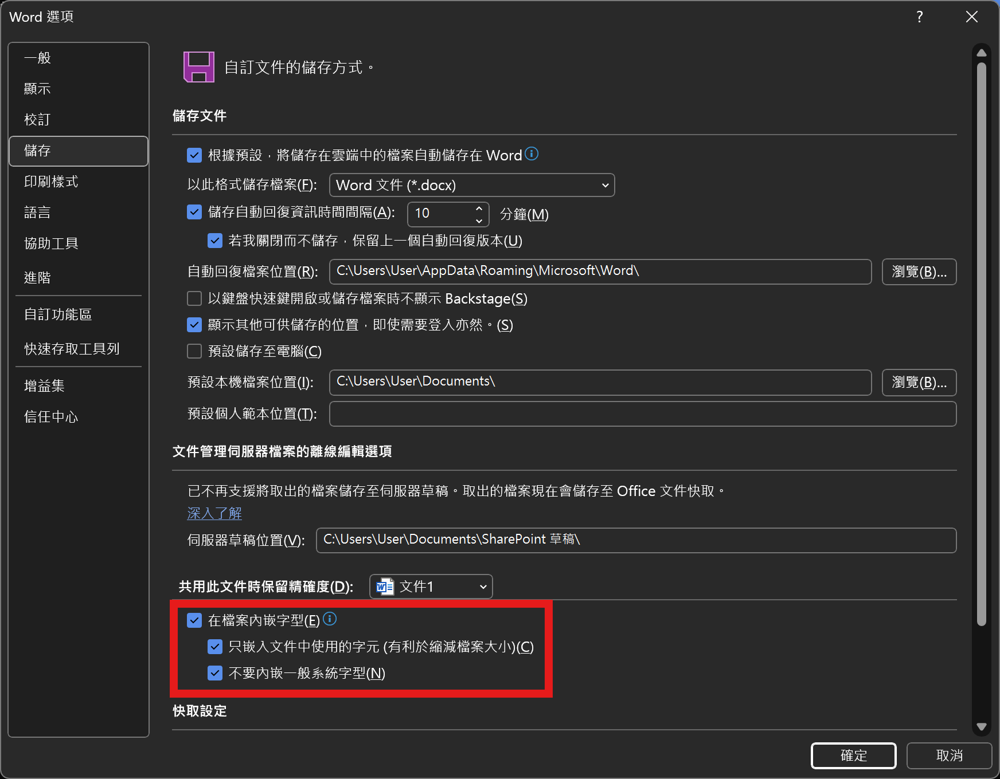
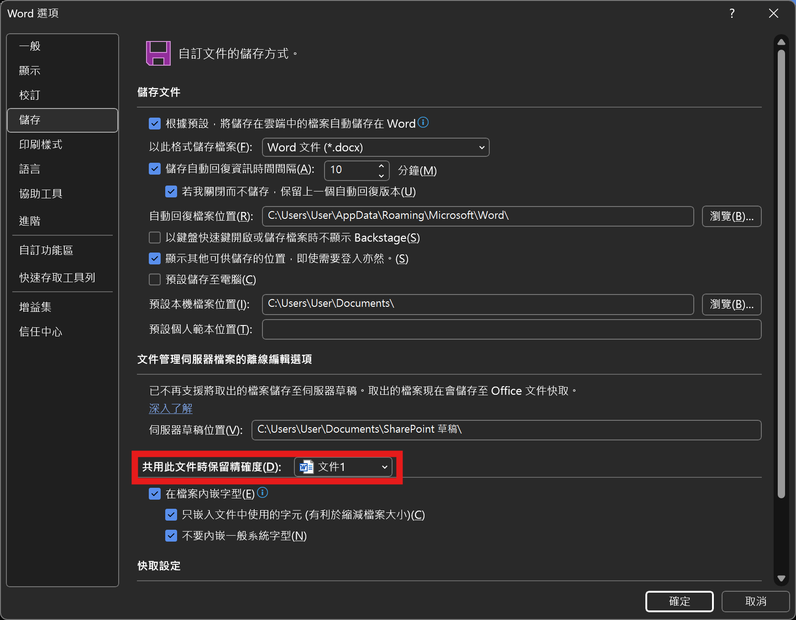

# 一貫道安東道場母字修正字型

## 安裝

### 下載字型檔

[下載連結 Download Link](https://github.com/minhung1126/andong_fonts/releases/latest/download/Andong-font.ttf)

依序按下\[**右鍵**\]、\[**另存連結（另存連結為）**\]，並選擇一個好記的位置。

### 安裝字型檔（Windows）

1. 找到下載的檔案，並依序按下\[**右鍵**\]、\[**開啟檔案**\]、\[**Windows字型檢視器**\]。
2. 按下左上角的\[**安裝**\]。

## 使用

### 適用場景

任何可以修改字型的軟體，如：Microsoft軟體（Word、Excel、Powerpoint）。

### 使用方法

打出母親的「母」後，將「母」的字體換成「一貫道安東道場母字」即可。

### 攜帶檔案

**如果需要將檔案傳給其他人，但對方沒有這個字型怎麼辦？**

#### 方法一：轉為PDF檔（推薦）

點選\[**另存新檔**\]，格式選擇\[**PDF**\]。

#### 方法二：Microsoft軟體設定內嵌字型

（以Microsoft 365 Word 說明）

1. 開啟Word，並在左上角點擊\[**檔案**\]。

2. 左下角選擇\[**選項**\]。

3. 左方選擇\[**儲存**\]。

4. 將\[**在檔案內嵌字型**\]打勾，也將\[**只嵌入文件中使用的字元**\]打勾。

5. （可選）若想一勞永逸，可以將上方\[**共用此文件時保留精確度**\]改為\[**所有新文件**\]，並依步驟1-4再設定一次。

> 此方法由Microsoft提供，不保證穩定性，請以轉為PDF為優先。

## 授權

本字型修改自**CNS11643中文標準交換碼全字庫**，遵守**政府資料開放授權條款-第1版**以及**開放字型授權條款 OFL-1.1**。
